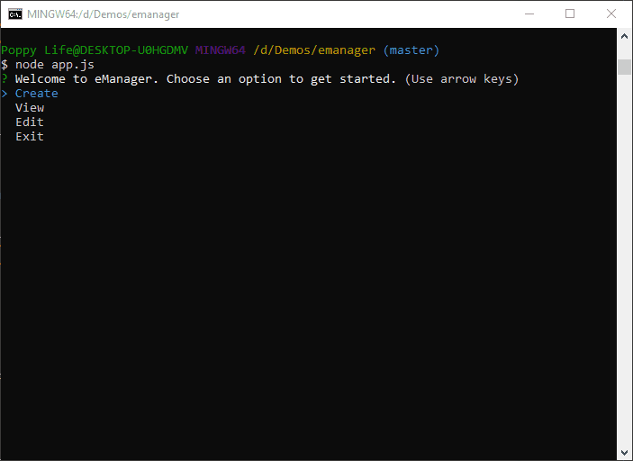
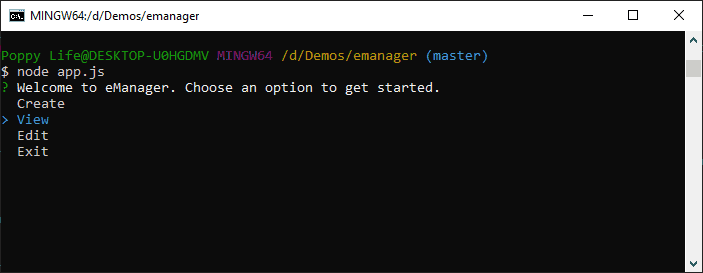
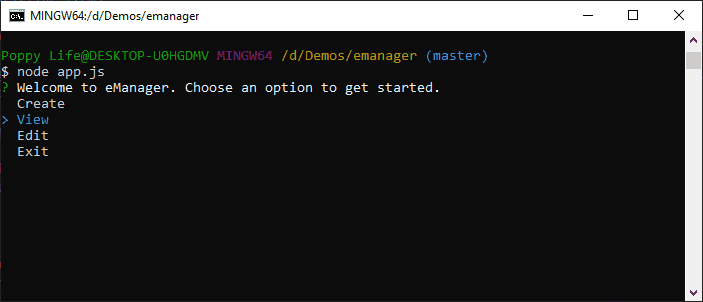

# eManager

## Description

This application interfaces with the user through the command-line to edit view and maintain a database of employees. Employees have ids, first and last names, roles, and managers. Roles can have salaries and belong to departments. The user can edit existing employee's names, managers, and roles, as well as edit role's designated department and salary. The application also allows the removal of departments roles and employees. These removal processes come with options for dealing with items dependent on the item being removed.

## Table of Contents

- [Installation](#installation)
- [Usage](#usage)
- [Credits](#credits)
- [License](#license)

## Installation

### Download Repository

Download this [repository](https://github.com/amargolies88/teamgen).

### Download Node.js

You must have node.js to run this application. Download node.js [here](https://nodejs.org/en/)

### Setup MySQL Database

Check out this [guide](https://dev.mysql.com/doc/mysql-getting-started/en/) for setting up a MySQL database. Your database must be named as "employeeDB" with username and password as "root" for this application to work. If you would like to use a different database name, username, or password, you must edit [app.js](./app.js) around line 11.

### Install the node packages

- Open command prompt (windows) or terminal (mac).
- Using the commands 'ls' (list current directory) and 'cd' (change directory) navigate to the root directory of the downloaded repository.
- Enter 'npm i'
- Wait for the node packages to finish installing.

## Usage

### Run Using Node.js

Using command prompt or command-line terminal of your choice navigate to the application's root directory and run the command "node app.js"

### Create Departments, Roles, and Employees

The first option in the home menu allows you to create departments, roles, and employees. Just follow the prompts on the screen. Note: if your database is empty the application will not allow you to create an employee before a role. The application will also not allow you to create a role before a department.

### View

Select the view menu and you will be given choices for viewing departments roles or employees. The view is displayed in table format for easy reading.

### Edit

You can edit any information in the database. Just select edit from the home menu and follow the prompts. You can change the names and values of all items.

### Deleting Items

Some items are dependent upon others. For example, employees can be assigned a manager. When deleting items that have dependents the application will allow you options to deal with the dependents. To delete an item first access the edit menu from the main menu. Then select the item you want to delete by selecting the category it belongs to and then the item. The application will ask you to confirm this action. If the item has no dependents the item will be deleted, otherwise the item will be deleted after you have decided through the following prmopt how to manage the dependents.

## Credits

[NodeJS](https://nodejs.org/en/)

[MySQL](https://www.mysql.com/)

[mysql Node Package](https://www.npmjs.com/package/mysql)

[Inquirer Node Package](https://www.npmjs.com/package/inquirer)

[console.table Node Package](https://www.npmjs.com/package/mysql)

[GitHub](https://github.com/)

[Visual Studio Code](https://code.visualstudio.com)

## License

Creative Commons Legal Code

CC0 1.0 Universal

    CREATIVE COMMONS CORPORATION IS NOT A LAW FIRM AND DOES NOT PROVIDE
    LEGAL SERVICES. DISTRIBUTION OF THIS DOCUMENT DOES NOT CREATE AN
    ATTORNEY-CLIENT RELATIONSHIP. CREATIVE COMMONS PROVIDES THIS
    INFORMATION ON AN "AS-IS" BASIS. CREATIVE COMMONS MAKES NO WARRANTIES
    REGARDING THE USE OF THIS DOCUMENT OR THE INFORMATION OR WORKS
    PROVIDED HEREUNDER, AND DISCLAIMS LIABILITY FOR DAMAGES RESULTING FROM
    THE USE OF THIS DOCUMENT OR THE INFORMATION OR WORKS PROVIDED
    HEREUNDER.

Statement of Purpose

The laws of most jurisdictions throughout the world automatically confer
exclusive Copyright and Related Rights (defined below) upon the creator
and subsequent owner(s) (each and all, an "owner") of an original work of
authorship and/or a database (each, a "Work").

Certain owners wish to permanently relinquish those rights to a Work for
the purpose of contributing to a commons of creative, cultural and
scientific works ("Commons") that the public can reliably and without fear
of later claims of infringement build upon, modify, incorporate in other
works, reuse and redistribute as freely as possible in any form whatsoever
and for any purposes, including without limitation commercial purposes.
These owners may contribute to the Commons to promote the ideal of a free
culture and the further production of creative, cultural and scientific
works, or to gain reputation or greater distribution for their Work in
part through the use and efforts of others.

For these and/or other purposes and motivations, and without any
expectation of additional consideration or compensation, the person
associating CC0 with a Work (the "Affirmer"), to the extent that he or she
is an owner of Copyright and Related Rights in the Work, voluntarily
elects to apply CC0 to the Work and publicly distribute the Work under its
terms, with knowledge of his or her Copyright and Related Rights in the
Work and the meaning and intended legal effect of CC0 on those rights.

1. Copyright and Related Rights. A Work made available under CC0 may be
   protected by copyright and related or neighboring rights ("Copyright and
   Related Rights"). Copyright and Related Rights include, but are not
   limited to, the following:

i. the right to reproduce, adapt, distribute, perform, display,
communicate, and translate a Work;
ii. moral rights retained by the original author(s) and/or performer(s);
iii. publicity and privacy rights pertaining to a person's image or
likeness depicted in a Work;
iv. rights protecting against unfair competition in regards to a Work,
subject to the limitations in paragraph 4(a), below;
v. rights protecting the extraction, dissemination, use and reuse of data
in a Work;
vi. database rights (such as those arising under Directive 96/9/EC of the
European Parliament and of the Council of 11 March 1996 on the legal
protection of databases, and under any national implementation
thereof, including any amended or successor version of such
directive); and
vii. other similar, equivalent or corresponding rights throughout the
world based on applicable law or treaty, and any national
implementations thereof.

2. Waiver. To the greatest extent permitted by, but not in contravention
   of, applicable law, Affirmer hereby overtly, fully, permanently,
   irrevocably and unconditionally waives, abandons, and surrenders all of
   Affirmer's Copyright and Related Rights and associated claims and causes
   of action, whether now known or unknown (including existing as well as
   future claims and causes of action), in the Work (i) in all territories
   worldwide, (ii) for the maximum duration provided by applicable law or
   treaty (including future time extensions), (iii) in any current or future
   medium and for any number of copies, and (iv) for any purpose whatsoever,
   including without limitation commercial, advertising or promotional
   purposes (the "Waiver"). Affirmer makes the Waiver for the benefit of each
   member of the public at large and to the detriment of Affirmer's heirs and
   successors, fully intending that such Waiver shall not be subject to
   revocation, rescission, cancellation, termination, or any other legal or
   equitable action to disrupt the quiet enjoyment of the Work by the public
   as contemplated by Affirmer's express Statement of Purpose.

3. Public License Fallback. Should any part of the Waiver for any reason
   be judged legally invalid or ineffective under applicable law, then the
   Waiver shall be preserved to the maximum extent permitted taking into
   account Affirmer's express Statement of Purpose. In addition, to the
   extent the Waiver is so judged Affirmer hereby grants to each affected
   person a royalty-free, non transferable, non sublicensable, non exclusive,
   irrevocable and unconditional license to exercise Affirmer's Copyright and
   Related Rights in the Work (i) in all territories worldwide, (ii) for the
   maximum duration provided by applicable law or treaty (including future
   time extensions), (iii) in any current or future medium and for any number
   of copies, and (iv) for any purpose whatsoever, including without
   limitation commercial, advertising or promotional purposes (the
   "License"). The License shall be deemed effective as of the date CC0 was
   applied by Affirmer to the Work. Should any part of the License for any
   reason be judged legally invalid or ineffective under applicable law, such
   partial invalidity or ineffectiveness shall not invalidate the remainder
   of the License, and in such case Affirmer hereby affirms that he or she
   will not (i) exercise any of his or her remaining Copyright and Related
   Rights in the Work or (ii) assert any associated claims and causes of
   action with respect to the Work, in either case contrary to Affirmer's
   express Statement of Purpose.

4. Limitations and Disclaimers.

a. No trademark or patent rights held by Affirmer are waived, abandoned,
surrendered, licensed or otherwise affected by this document.
b. Affirmer offers the Work as-is and makes no representations or
warranties of any kind concerning the Work, express, implied,
statutory or otherwise, including without limitation warranties of
title, merchantability, fitness for a particular purpose, non
infringement, or the absence of latent or other defects, accuracy, or
the present or absence of errors, whether or not discoverable, all to
the greatest extent permissible under applicable law.
c. Affirmer disclaims responsibility for clearing rights of other persons
that may apply to the Work or any use thereof, including without
limitation any person's Copyright and Related Rights in the Work.
Further, Affirmer disclaims responsibility for obtaining any necessary
consents, permissions or other rights required for any use of the
Work.
d. Affirmer understands and acknowledges that Creative Commons is not a
party to this document and has no duty or obligation with respect to
this CC0 or use of the Work.
